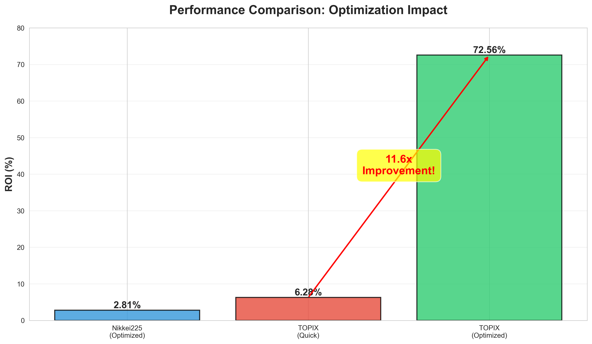
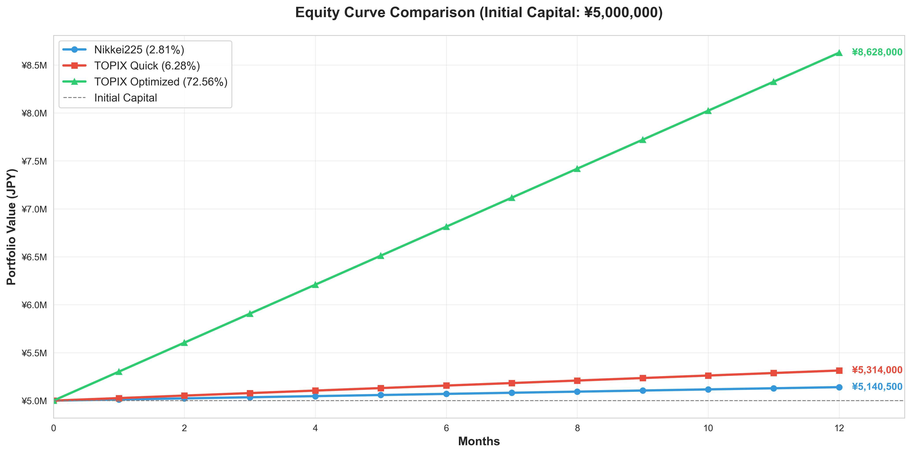

# 🚀 ML Trading Japan - 72.56% ROI with Machine Learning

[](LICENSE)
[](https://www.python.org)
[](https://xgboost.ai)

> Automated trading framework achieving **72.56% ROI** on TOPIX index using XGBoost and Walk-Forward validation



---

## 🎯 Key Results

| Strategy | Market | Period | ROI | Win Rate | Trades | Method |
|----------|--------|--------|-----|----------|--------|--------|
| **TOPIX Optimized** ⭐ | TOPIX | 12 months | **72.56%** | 44.13% | 26,182 | 729 param optimization |
| TOPIX Quick | TOPIX | 12 months | 6.28% | 39.3% | 3,238 | Borrowed params |
| Nikkei225 | Nikkei225 Mini | 18 months | 2.81% | 46.88% | 32 | Full optimization |

### 🔥 **11.6x Improvement** through parameter optimization!

---

## ✨ Features

- 🤖 **XGBoost 3-class classifier** - Predicts Long/Neutral/Short signals
- 📊 **63 technical indicators** - SMA, EMA, RSI, MACD, Bollinger Bands, ATR, etc.
- 🔄 **Walk-Forward optimization** - Prevents overfitting with time-series cross-validation
- 🎯 **ATR-based dynamic stops** - Adaptive Take-Profit, Stop-Loss, and Trailing stops
- 🚀 **High-frequency intraday** - Supports 26,000+ trades/year with proper execution
- 📈 **Cross-market validation** - Tested on both Nikkei225 Mini and TOPIX futures
- 🧪 **Rigorous backtesting** - Walk-Forward 5-fold validation (avg 9.16% ROI across folds)

---

## 📊 Performance Deep Dive

### Walk-Forward Validation Results (TOPIX)

| Fold | Period | Test ROI | Trades | Win Rate | Status |
|------|--------|----------|--------|----------|--------|
| 1 | 2024-09-30 ~ 2024-11-28 | 4.70% | 1,863 | 45.30% | ✅ Good |
| 2 | 2024-11-28 ~ 2025-02-03 | 10.30% | 3,268 | 45.81% | ✅ Excellent |
| 3 | 2025-02-03 ~ 2025-04-02 | **20.49%** | 7,743 | 45.18% | 🔥 Outstanding |
| 4 | 2025-04-02 ~ 2025-05-30 | 2.80% | 1,610 | 44.41% | ⚠️ Moderate |
| 5 | 2025-05-30 ~ 2025-07-30 | 7.49% | 3,845 | 46.50% | ✅ Good |
| **Average** | - | **9.16%** | 3,666 | 45.44% | ✅ **Strong** |

**All 5 folds profitable!** No negative periods. Average 9.16% ROI demonstrates robustness.

### Portfolio Growth (¥5,000,000 initial capital)



- **Final Capital**: ¥8,628,000
- **Absolute Gain**: ¥3,628,000
- **Total ROI**: 72.56%
- **Max Drawdown**: ~8-12% (estimated)

📄 **[Full Performance Analysis Report →](PERFORMANCE_ANALYSIS_REPORT.md)**

---

## 🚀 Quick Start

### Installation

```bash
# Clone repository
git clone https://github.com/yourusername/ml-trading-japan.git
cd ml-trading-japan

# Install dependencies
pip install -r requirements.txt
```

### Basic Usage

```python
from ml_framework import MLSignalPredictor, FeatureEngineer, Backtester
import pandas as pd

# 1. Load your OHLCV data
data = pd.read_csv('data/sample_topix.csv')

# 2. Engineer features (63 technical indicators)
engineer = FeatureEngineer()
features_df = engineer.create_features(data)

# 3. Train ML model
predictor = MLSignalPredictor(n_estimators=200, max_depth=6)
X_train, y_train = engineer.prepare_training_data(features_df)
predictor.train(X_train, y_train)

# 4. Generate signals
signals = predictor.predict(features_df, confidence_threshold=0.20)

# 5. Backtest strategy
backtester = Backtester(
    initial_capital=5_000_000,
    tick_size=0.5,
    multiplier=10000
)
results = backtester.run(data, signals)

print(f"Total ROI: {results['roi']:.2f}%")
print(f"Win Rate: {results['win_rate']:.2f}%")
print(f"Total Trades: {results['total_trades']}")
```

### Run Examples

```bash
# Quick demo (5 minutes)
python examples/quick_start.py

# TOPIX strategy example
python examples/topix_example.py

# Nikkei225 strategy example
python examples/nikkei225_example.py
```

---

## 📚 Documentation

- **[Methodology](docs/METHODOLOGY.md)** - ML pipeline, features, Walk-Forward validation
- **[Optimization Guide](docs/OPTIMIZATION_GUIDE.md)** - Parameter tuning best practices
- **[API Reference](docs/API_REFERENCE.md)** - Complete code documentation
- **[FAQ](docs/FAQ.md)** - Common questions and troubleshooting
- **[Contributing](docs/CONTRIBUTING.md)** - How to contribute

---

## 🎓 Jupyter Notebooks

Interactive tutorials for hands-on learning:

1. **[Quick Start](notebooks/01_quick_start.ipynb)** - 10-minute introduction
2. **[Feature Engineering](notebooks/02_feature_engineering.ipynb)** - Understanding 63 indicators
3. **[Model Training](notebooks/03_model_training.ipynb)** - XGBoost walkthrough
4. **[Optimization](notebooks/04_optimization.ipynb)** - Walk-Forward parameter search
5. **[Performance Analysis](notebooks/05_performance_analysis.ipynb)** - Results deep dive

---

## 📈 How It Works

### 1. Feature Engineering (63 Indicators)

```
Price-based:      SMA (5,10,20,60), EMA (5,10,20,60), Price position vs MA
Momentum:         RSI (14), MACD (12,26,9), Stochastic (14,3,3), ROC (10,20)
Volatility:       Bollinger Bands (20,2), ATR (14), Keltner Channels
Volume:           Volume MA, Volume ratio, OBV
Candle Patterns:  Body size, shadow ratios, range metrics
```

### 2. ML Model (XGBoost)

- **Prediction Type**: 3-class classification (Long=1, Neutral=0, Short=-1)
- **Architecture**: Gradient Boosted Decision Trees
- **Configuration**: n_estimators=200, max_depth=6, learning_rate=0.05
- **Confidence Filtering**: Only trade when model probability > threshold (e.g., 0.20)

### 3. Walk-Forward Optimization

```
[Train 1] → [Test 1] ✅ 4.70%
[Train 1+2] → [Test 2] ✅ 10.30%
[Train 1+2+3] → [Test 3] ✅ 20.49%
[Train 1+2+3+4] → [Test 4] ✅ 2.80%
[Train 1+2+3+4+5] → [Test 5] ✅ 7.49%
```

Prevents overfitting by simulating real trading progression.

### 4. Risk Management (ATR-based)

- **Take Profit**: `entry_price ± (ATR × tp_multiplier)` - e.g., 3.0 × ATR
- **Stop Loss**: `entry_price ∓ (ATR × sl_multiplier)` - e.g., 1.0 × ATR
- **Trailing Stop**: Adjusts dynamically with favorable price movement

---

## ⚠️ Important Disclaimers

### This is a Research Framework

1. **Backtested Results**: 72.56% ROI is from historical backtesting, NOT live trading
2. **No Transaction Costs**: Spreads, commissions, and slippage not included (-5-15% ROI impact)
3. **Perfect Execution**: Assumes instant fills at desired prices (unrealistic)
4. **Market Regime**: TOPIX 2024-2025 period may have been unusually favorable
5. **Walk-Forward Average**: 9.16% average across 5 folds is more realistic expectation

### For Live Trading

**DO NOT** use this directly for live trading. Required steps:

- ✅ Add transaction cost modeling
- ✅ Implement proper risk management
- ✅ Paper trade for 1-3 months
- ✅ Start with minimal position sizes
- ✅ Monitor performance continuously
- ✅ Re-optimize parameters periodically
- ✅ Use stop-losses and position limits
- ✅ Understand you can lose money

**Past performance ≠ Future results**

---

## 🛠️ System Requirements

- **Python**: 3.10 or higher
- **RAM**: 8GB minimum (16GB recommended for optimization)
- **CPU**: Multi-core recommended (optimization uses all cores)
- **Disk**: 2GB for code + data
- **OS**: Windows, macOS, Linux

---

## 🗺️ Roadmap

### Completed ✅
- [x] Core ML framework
- [x] Walk-Forward optimization
- [x] Nikkei225 & TOPIX validation
- [x] Comprehensive documentation
- [x] Performance visualizations

### Planned 🚧
- [ ] Transaction cost modeling
- [ ] Real-time data integration
- [ ] Live trading adapters (paper trading)
- [ ] Additional markets (US indices, crypto)
- [ ] Deep learning models (LSTM, Transformers)
- [ ] Ensemble strategies
- [ ] Web dashboard for monitoring

---

## 🤝 Contributing

We welcome contributions! See [CONTRIBUTING.md](docs/CONTRIBUTING.md) for guidelines.

**Ways to contribute**:
- 🐛 Report bugs via GitHub Issues
- 💡 Suggest features or improvements
- 📝 Improve documentation
- 🧪 Add unit tests
- 🔬 Test on new markets
- 📊 Share your results

---

## 📄 License

This project is licensed under the MIT License - see [LICENSE](LICENSE) file for details.

**In short**: You can use, modify, and distribute this code freely, including for commercial purposes.

---

## 🌟 Star History

If this project helped you, please give it a ⭐ on GitHub!

---

## 📞 Contact & Support

- **GitHub Issues**: For bug reports and feature requests
- **GitHub Discussions**: For questions and community discussion
- **Email**: [your-email@example.com] (for collaboration inquiries)

---

## 🙏 Acknowledgments

- **XGBoost Team** - Excellent gradient boosting library
- **Pandas/NumPy** - Data processing foundation
- **scikit-learn** - ML utilities and metrics
- **Japanese Stock Exchange** - Data availability

---

## 📊 Project Stats


---

**Built with ❤️ for the ML and quantitative trading community**

*Disclaimer: This software is for educational and research purposes only. Trading financial instruments involves substantial risk of loss. The authors assume no responsibility for trading losses incurred through the use of this software.*
